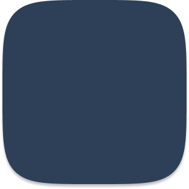
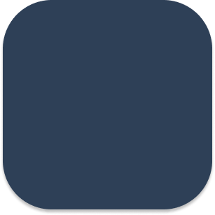

# react-native-squircle-layout

A React Native component that renders a squircle shape. This component allows you to create a squircle shape with a color of your choice and use it as a background for other components.

<div style="display: flex; justify-content: center; align-items: center; gap: 40px;">
  <div style="display: flex; flex-direction: column; justify-content: center; align-items: center; gap: 20px">
    <h3>With Corner Smoothing</h3>
    
  </div>
  <div style="display: flex; flex-direction: column; justify-content: center; align-items: center; gap: 20px"
  >
    <h3>Without Corner Smoothing</h3>
    
  </div>
</div>

## Installation

```sh
npm install react-native-squircle-layout
```

or

```sh
yarn add react-native-squircle-layout
```

## Usage

Import the SquircleView component and use it to wrap your components.

```tsx
import { SquircleView } from 'react-native-squircle-layout';

function App() {
  return (
    <SquircleView
      cornerRadius={20}
      cornerSmoothing={1}
      color="#3498db"
      width={200}
      height={200}
      style={{ justifyContent: 'center', alignItems: 'center' }}
    >
      {/* Your content here */}
    </SquircleView>
  );
}

export default App;
```

- Note: If width and height are not provided, the squircle will dynamically size itself based on its children.

- Note: You can also set width and height as the color to have a solid squircle shape without children.

## Props

<table>
<tr>
  <th>Prop</th>
  <th>Type</th>
  <th>Description</th>
  <th>Required</th>
  <th>Default</th>
</tr>
<tr>
  <td><code>cornerRadius</code></td>
  <td><code>number</code></td>
  <td>Specifies the corner radius of the squircle shape.</td>
  <td>Yes</td>
  <td>0</td>
</tr>
<tr>
  <td><code>cornerSmoothing</code></td>
  <td><code>number</code></td>
  <td>Adjusts the smoothness of the corners.</td>
  <td>No</td>
  <td>0.6</td>
</tr>
<tr>
  <td><code>color</code></td>
  <td><code>string</code></td>
  <td>Sets the background color of the squircle shape.</td>
  <td>No</td>
  <td>transparent</td>
</tr>
<tr>
  <td><code>width</code></td>
  <td><code>number</code></td>
  <td>Sets the width of the squircle shape.</td>
  <td>No</td>
  <td>undefined</td>
</tr>
<tr>
  <td><code>height</code></td>
  <td><code>number</code></td>
  <td>Sets the height of the squircle shape.</td>
  <td>No</td>
  <td>undefined</td>
</tr>
</table>

Other <code>View</code> Props

All other View props from React Native are supported.

## Example
<div style="display: flex; justify-content: center; align-items: center;">
<video width="320" height="640" loop autoplay controls>
  <source src="./assets/example.mp4" type="video/mp4">
  Your browser does not support the video tag.
</video>
</div>

## Contributing

See the [contributing guide](CONTRIBUTING.md) to learn how to contribute to the repository and the development workflow.

## License

[MIT](LICENSE)

---

Made with [create-react-native-library](https://github.com/callstack/react-native-builder-bob)
